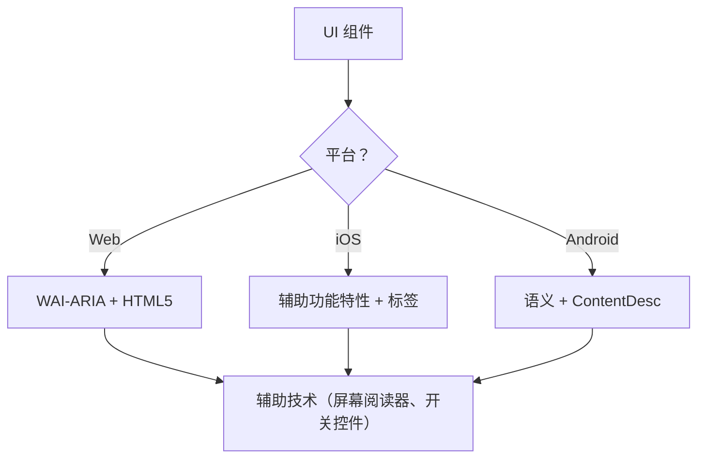

# 无障碍访问（WCAG 2.2）

本技能确保数字界面对所有用户——包括使用屏幕阅读器、开关控件或键盘导航的用户——都遵循可感知、可操作、可理解、健壮（POUR）原则。它专注于 WCAG 2.2 成功标准的技术实现。

## 何时使用

- 为 Web、iOS 或 Android 定义 UI 组件规范。
- 审计现有代码中的无障碍访问障碍或合规缺口。
- 实现新的 WCAG 2.2 标准，如目标尺寸（最小值）和焦点外观。
- 将高层设计需求映射到技术属性（ARIA 角色、特性、提示）。

## 核心概念

- **POUR 原则**：WCAG 的基础（可感知、可操作、可理解、健壮）。
- **语义映射**：优先使用原生元素而非通用容器，以获得内置的无障碍支持。
- **无障碍树**：辅助技术实际"读取"的 UI 表示形式。
- **焦点管理**：控制键盘/屏幕阅读器光标的顺序和可见性。
- **标签与提示**：通过 `aria-label`、`accessibilityLabel` 和 `contentDescription` 提供上下文。

## 工作原理

### 第一步：确定组件角色

明确组件的功能用途（例如：这是按钮、链接还是选项卡？）。在使用自定义角色之前，优先选用最具语义化的原生元素。

### 第二步：定义可感知属性

- 确保文本对比度达到 **4.5:1**（普通文本）或 **3:1**（大文本/UI 元素）。
- 为非文本内容（图片、图标）添加文本替代内容。
- 实现响应式重排（缩放至 400% 时不丢失功能）。

### 第三步：实现可操作控件

- 确保最小 **24×24 CSS 像素**目标尺寸（WCAG 2.2 SC 2.5.8）。
- 验证所有交互元素均可通过键盘访问，并具有可见的焦点指示器（SC 2.4.11）。
- 为拖动操作提供单指针替代方案。

### 第四步：确保可理解的逻辑

- 使用一致的导航模式。
- 提供描述性错误信息和纠正建议（SC 3.3.3）。
- 实现"冗余输入"（SC 3.3.7），避免重复要求用户填写相同数据。

### 第五步：验证健壮的兼容性

- 使用正确的"名称、角色、值"模式。
- 为动态状态更新实现 `aria-live` 或实时区域。

## 无障碍架构图



## 跨平台映射

| 功能               | Web（HTML/ARIA）         | iOS（SwiftUI）                       | Android（Compose）                                          |
| :----------------- | :----------------------- | :----------------------------------- | :---------------------------------------------------------- |
| **主标签**         | `aria-label` / `<label>` | `.accessibilityLabel()`              | `contentDescription`                                        |
| **辅助提示**       | `aria-describedby`       | `.accessibilityHint()`               | `Modifier.semantics { stateDescription = ... }`             |
| **操作角色**       | `role="button"`          | `.accessibilityAddTraits(.isButton)` | `Modifier.semantics { role = Role.Button }`                 |
| **实时更新**       | `aria-live="polite"`     | `.accessibilityLiveRegion(.polite)`  | `Modifier.semantics { liveRegion = LiveRegionMode.Polite }` |

## 示例

### Web：无障碍搜索

```html
<form role="search">
  <label for="search-input" class="sr-only">Search products</label>
  <input type="search" id="search-input" placeholder="Search..." />
  <button type="submit" aria-label="Submit Search">
    <svg aria-hidden="true">...</svg>
  </button>
</form>
```

### iOS：无障碍操作按钮

```swift
Button(action: deleteItem) {
    Image(systemName: "trash")
}
.accessibilityLabel("Delete item")
.accessibilityHint("Permanently removes this item from your list")
.accessibilityAddTraits(.isButton)
```

### Android：无障碍开关

```kotlin
Switch(
    checked = isEnabled,
    onCheckedChange = { onToggle() },
    modifier = Modifier.semantics {
        contentDescription = "Enable notifications"
    }
)
```

## 应避免的反模式

- **Div 按钮**：使用 `<div>` 或 `<span>` 处理点击事件，却未添加角色和键盘支持。
- **仅用颜色表达含义**：仅通过颜色变化（如将边框变为红色）来标示错误或状态。
- **模态框焦点不受限**：模态框不捕获焦点，导致键盘用户在模态框打开时仍可导航到背景内容。焦点必须被限制在模态框内，且可通过 `Escape` 键或显式关闭按钮离开（WCAG SC 2.1.2）。
- **冗余 Alt 文本**：在 alt 文本中使用"Image of..."或"Picture of..."（屏幕阅读器已会播报"图像"角色）。

## 最佳实践清单

- [ ] 交互元素满足 **24×24px**（Web）或 **44×44pt**（原生）目标尺寸。
- [ ] 焦点指示器清晰可见且高对比度。
- [ ] 模态框打开时**捕获焦点**，关闭时干净释放（`Escape` 键或关闭按钮）。
- [ ] 下拉菜单关闭时将焦点还原到触发元素。
- [ ] 表单提供基于文本的错误建议。
- [ ] 所有纯图标按钮均有描述性文本标签。
- [ ] 文本缩放时内容能正确重排。

## 参考资料

- [WCAG 2.2 指南](https://www.w3.org/TR/WCAG22/)
- [WAI-ARIA 创作实践](https://www.w3.org/TR/wai-aria-practices/)
- [iOS 无障碍编程指南](https://developer.apple.com/documentation/accessibility)
- [iOS 人机界面指南 - 无障碍](https://developer.apple.com/design/human-interface-guidelines/accessibility)
- [Android 无障碍开发者指南](https://developer.android.com/guide/topics/ui/accessibility)

## 相关技能

- `frontend-patterns`
- `frontend-design`
- `liquid-glass-design`
- `swiftui-patterns`
