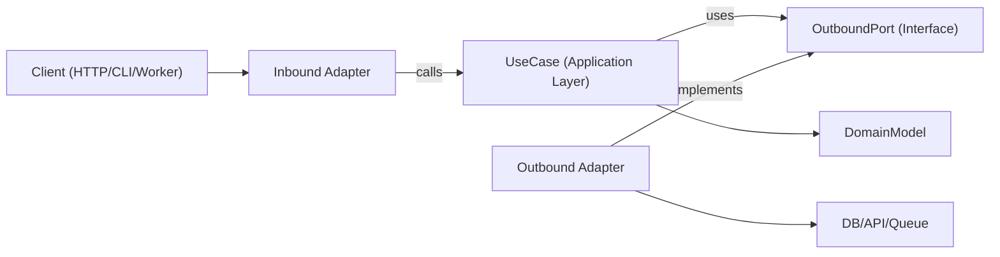

# 六边形架构

六边形架构（端口与适配器）使业务逻辑独立于框架、传输层和持久化细节。核心应用依赖抽象端口，适配器在边缘实现这些端口。

## 使用时机

- 构建需要长期可维护性和可测试性的新功能。
- 重构层次化或框架重度的代码，其中领域逻辑与 I/O 关注点混杂。
- 为同一用例支持多种接口（HTTP、CLI、队列工作者、定时任务）。
- 在不重写业务规则的情况下替换基础设施（数据库、外部 API、消息总线）。

当请求涉及边界设计、领域中心设计、重构紧耦合服务或解耦应用逻辑与特定库时，使用本技能。

## 核心概念

- **领域模型**：业务规则和实体/值对象。无框架导入。
- **用例（应用层）**：编排领域行为和工作流步骤。
- **入站端口**：描述应用能做什么的契约（命令/查询/用例接口）。
- **出站端口**：描述应用所需依赖的契约（仓库、网关、事件发布者、时钟、UUID 等）。
- **适配器**：端口的基础设施和传输层实现（HTTP 控制器、数据库仓库、队列消费者、SDK 封装）。
- **组合根**：将具体适配器绑定到用例的单一配置位置。

出站端口接口通常位于应用层（或仅在抽象真正属于领域级别时位于领域层），而基础设施适配器实现它们。

依赖方向始终向内：

- 适配器 -> 应用层/领域层
- 应用层 -> 端口接口（入站/出站契约）
- 领域层 -> 仅领域内抽象（无框架或基础设施依赖）
- 领域层 -> 不依赖任何外部内容

## 工作原理

### 第一步：建模用例边界

用清晰的输入和输出 DTO 定义单个用例。将传输细节（Express 的 `req`、GraphQL 的 `context`、任务负载包装器）保留在此边界之外。

### 第二步：先定义出站端口

将每个副作用识别为端口：

- 持久化（`UserRepositoryPort`）
- 外部调用（`BillingGatewayPort`）
- 横切关注点（`LoggerPort`、`ClockPort`）

端口应该建模能力，而非技术细节。

### 第三步：以纯编排方式实现用例

用例类/函数通过构造函数/参数接收端口。它验证应用级别的不变量，协调领域规则，并返回普通数据结构。

### 第四步：在边缘构建适配器

- 入站适配器将协议输入转换为用例输入。
- 出站适配器将应用契约映射到具体 API/ORM/查询构建器。
- 映射逻辑留在适配器中，而非用例内部。

### 第五步：在组合根中连接一切

实例化适配器，然后将其注入用例。保持配置集中，避免隐式的服务定位器行为。

### 第六步：按边界测试

- 用假端口对用例进行单元测试。
- 用真实基础设施依赖对适配器进行集成测试。
- 通过入站适配器对用户可见流程进行端到端测试。

## 架构图



## 建议模块布局

使用功能优先的组织方式，并设置明确的边界：

```text
src/
  features/
    orders/
      domain/
        Order.ts
        OrderPolicy.ts
      application/
        ports/
          inbound/
            CreateOrder.ts
          outbound/
            OrderRepositoryPort.ts
            PaymentGatewayPort.ts
        use-cases/
          CreateOrderUseCase.ts
      adapters/
        inbound/
          http/
            createOrderRoute.ts
        outbound/
          postgres/
            PostgresOrderRepository.ts
          stripe/
            StripePaymentGateway.ts
      composition/
        ordersContainer.ts
```

## TypeScript 示例

### 端口定义

```typescript
export interface OrderRepositoryPort {
  save(order: Order): Promise<void>;
  findById(orderId: string): Promise<Order | null>;
}

export interface PaymentGatewayPort {
  authorize(input: { orderId: string; amountCents: number }): Promise<{ authorizationId: string }>;
}
```

### 用例

```typescript
type CreateOrderInput = {
  orderId: string;
  amountCents: number;
};

type CreateOrderOutput = {
  orderId: string;
  authorizationId: string;
};

export class CreateOrderUseCase {
  constructor(
    private readonly orderRepository: OrderRepositoryPort,
    private readonly paymentGateway: PaymentGatewayPort
  ) {}

  async execute(input: CreateOrderInput): Promise<CreateOrderOutput> {
    const order = Order.create({ id: input.orderId, amountCents: input.amountCents });

    const auth = await this.paymentGateway.authorize({
      orderId: order.id,
      amountCents: order.amountCents,
    });

    // markAuthorized returns a new Order instance; it does not mutate in place.
    const authorizedOrder = order.markAuthorized(auth.authorizationId);
    await this.orderRepository.save(authorizedOrder);

    return {
      orderId: order.id,
      authorizationId: auth.authorizationId,
    };
  }
}
```

### 出站适配器

```typescript
export class PostgresOrderRepository implements OrderRepositoryPort {
  constructor(private readonly db: SqlClient) {}

  async save(order: Order): Promise<void> {
    await this.db.query(
      "insert into orders (id, amount_cents, status, authorization_id) values ($1, $2, $3, $4)",
      [order.id, order.amountCents, order.status, order.authorizationId]
    );
  }

  async findById(orderId: string): Promise<Order | null> {
    const row = await this.db.oneOrNone("select * from orders where id = $1", [orderId]);
    return row ? Order.rehydrate(row) : null;
  }
}
```

### 组合根

```typescript
export const buildCreateOrderUseCase = (deps: { db: SqlClient; stripe: StripeClient }) => {
  const orderRepository = new PostgresOrderRepository(deps.db);
  const paymentGateway = new StripePaymentGateway(deps.stripe);

  return new CreateOrderUseCase(orderRepository, paymentGateway);
};
```

## 多语言映射

在不同技术生态中遵循相同的边界规则；只有语法和配置风格有所不同。

- **TypeScript/JavaScript**
  - 端口：`application/ports/*` 中的接口/类型。
  - 用例：通过构造函数/参数注入的类/函数。
  - 适配器：`adapters/inbound/*`、`adapters/outbound/*`。
  - 组合：显式的工厂/容器模块（无隐式全局变量）。
- **Java**
  - 包：`domain`、`application.port.in`、`application.port.out`、`application.usecase`、`adapter.in`、`adapter.out`。
  - 端口：`application.port.*` 中的接口。
  - 用例：普通类（Spring 的 `@Service` 是可选的，不是必需的）。
  - 组合：Spring 配置类或手动配置类；将配置逻辑与领域/用例类分离。
- **Kotlin**
  - 模块/包镜像 Java 的分层（`domain`、`application.port`、`application.usecase`、`adapter`）。
  - 端口：Kotlin 接口。
  - 用例：通过构造函数注入的类（Koin/Dagger/Spring/手动）。
  - 组合：模块定义或专用组合函数；避免服务定位器模式。
- **Go**
  - 包：`internal/<feature>/domain`、`application`、`ports`、`adapters/inbound`、`adapters/outbound`。
  - 端口：由消费方应用包拥有的小接口。
  - 用例：带接口字段和显式 `New...` 构造函数的结构体。
  - 组合：在 `cmd/<app>/main.go`（或专用配置包）中进行，保持构造函数显式化。

## 需要避免的反模式

- 领域实体导入 ORM 模型、Web 框架类型或 SDK 客户端。
- 用例直接读取 `req`、`res` 或队列元数据。
- 从用例直接返回数据库行而不经过领域/应用映射。
- 让适配器直接互相调用，而非通过用例端口流转。
- 将依赖配置分散到多个文件中，形成隐式全局单例。

## 迁移手册

1. 选择一个垂直切片（单个端点/任务），该切片变更频繁且痛苦明显。
2. 提取具有显式输入/输出类型的用例边界。
3. 在现有基础设施调用周围引入出站端口。
4. 将编排逻辑从控制器/服务移入用例。
5. 保留旧适配器，但让它们委托给新用例。
6. 在新边界周围添加测试（单元测试 + 适配器集成测试）。
7. 逐个切片重复；避免全量重写。

### 重构现有系统

- **绞杀者模式**：保留当前端点，每次通过新端口/适配器路由一个用例。
- **禁止大爆炸式重写**：按功能切片迁移，通过特征测试保留行为。
- **门面优先**：在替换内部实现之前，用出站端口包装遗留服务。
- **组合冻结**：尽早集中配置逻辑，避免新依赖泄漏到领域/用例层。
- **切片选择规则**：优先处理变更频繁、爆炸半径小的流程。
- **回滚路径**：在生产行为验证通过之前，为每个迁移切片保留可逆的开关或路由切换。

## 测试指南（遵循相同的六边形边界）

- **领域测试**：将实体/值对象作为纯业务规则测试（无 mock，无框架配置）。
- **用例单元测试**：用假/存根替换出站端口测试编排；断言业务结果和端口交互。
- **出站适配器契约测试**：在端口级别定义共享契约套件，并针对每个适配器实现运行。
- **入站适配器测试**：验证协议映射（HTTP/CLI/队列负载到用例输入，以及输出/错误映射回协议）。
- **适配器集成测试**：针对真实基础设施（数据库/API/队列）运行，验证序列化、schema/查询行为、重试和超时。
- **端到端测试**：覆盖关键用户旅程，从入站适配器经用例到出站适配器。
- **重构安全网**：在提取之前添加特征测试；在新边界行为稳定等效之前保留这些测试。

## 最佳实践检查清单

- 领域层和用例层仅导入内部类型和端口。
- 每个外部依赖都以出站端口表示。
- 在边界处进行验证（入站适配器 + 用例不变量）。
- 使用不可变转换（返回新值/实体，而非修改共享状态）。
- 跨边界转换错误（基础设施错误 -> 应用/领域错误）。
- 组合根显式且易于审计。
- 用例可使用简单的内存假端口进行测试。
- 重构从一个垂直切片开始，并附有保留行为的测试。
- 语言/框架细节留在适配器中，绝不进入领域规则。
